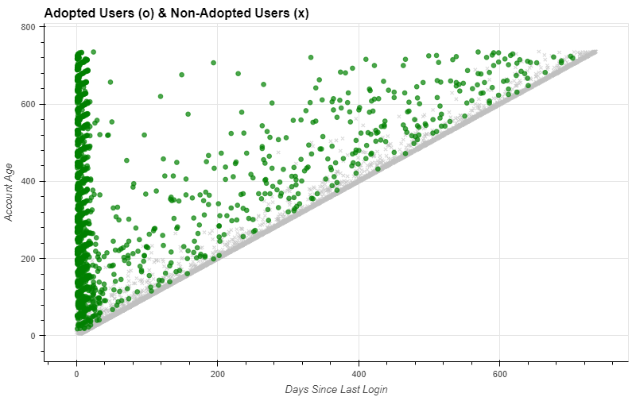
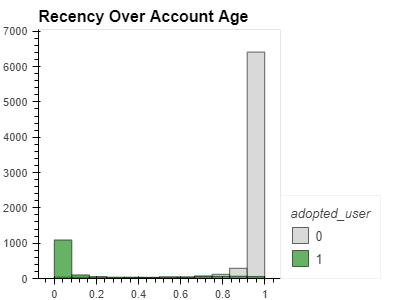
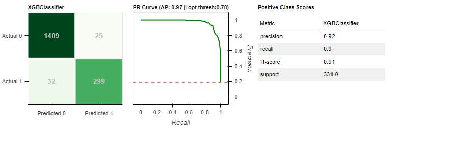
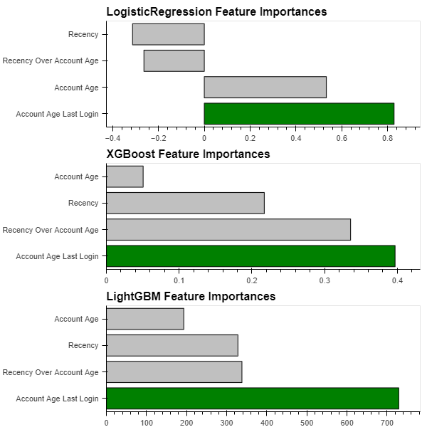

# User Adoption Prediction Analysis

## Introduction

Our brief analysis aimed to **identify which factors predict future user adoption**. 

> An "*adopted user*" is defined as a user who *has logged into the product on three separate days in at least one seven-day period*.

## Data
We analyzed 2 datasets
1. `takehome_users` : data of 12,000 users who signed up for the product between May 31 2012 and June 06 2014. Includes `object_id` (`user_id`) column as well as: `creation_time`, `last_session_creation_time`, `email`, `invited_by_user_id`, `org_id`, `invited_by_user_id` & `creation_source`.
2. `takehome_user_engagement` : daily login data for these users, includes `user_id` and `time_stamp` (`207,917` rows).

## Data Preparation
The target variable was established using the `takehome_user_engagement` dataset. We then cleaned the `takehome_users` dataset by handling missing values and ensuring each user row matched with the target variable, `adopted_user`. With no more missing values, we merged the `adopted_user` feature with the `takehome_users` dataset in preparation for exploratory data analysis.

## Exploratory Data Analysis
**Categorical Features**: 
Key insights into the `user_adoption` was found where self-invitation i.e. `invited_by_user_id` was the same as `user_id`. This had a **28%** adoption rate when compared to the **19%** of the users who did not self-invite.
Other features with high `adopted_user`s were `creation_source` for  `GUEST_INVITE` and `PERSONAL_PROJECTS`,  users with `hotmail` email addresses, but these factors only affected  minor portions of the dataset. 
**Numerical Features**: 
The `last_login`  and `creation_time`, 2 datetime columns were used to create the numerical columns we would later use in the model.

## Feature Engineering
By combining the `last_login` and `creation_time` columns, we created  4 numerical features which we later used in the model. They were:
- `account_age` : the time between the `creation_time` and the max login date.
- `days_since_last_login` : the time between the `last_login` and the max login date.
- `account_age_last_login` : the time between `creation_time` and `last_login` at the last login date.
- `recency_over_account_age` : the ratio of `days_since_last_login` to `account_age`.

  
Despite the high correlation (`corr = 0.79`) between `days_since_last_login` and `account_age`, we decided to retain both features in our model. This decision was informed by the distinct patterns observed in their distributions when separated by the target variable, as illustrated in the violin plots. These unique distributions suggest that each feature contributes valuable, unique information to the model.

In the scatter plot of `days_since_last_login` and `account_age`, distinct patterns emerged, effectively separating adopted users from non-adopted users.  

All features were derived from a different dataset than the target variable, `adopted_user`, as to avoid data leakage.

## Model Building and Results
With these 4 numerical features, we trained and tested 3 models:
- Logistic Regression
- LightGBM
- XGBoost

We utilized `RandomSearchCV` for hyperparameter tuning in our models. This method performs a randomized search on hyperparameters, providing a more efficient approach than exhaustive search methods. The use of `RandomSearchCV` not only optimizes our models but also saves computational resources. 

In the context of our analysis, this was particularly beneficial. By optimizing on `average_precision`, we were able to effectively handle our imbalanced dataset. Unlike ROC AUC, which can be overly optimistic for imbalanced classes, `average_precision` provides a more accurate measure of performance across all thresholds. This is because it summarizes the precision-recall curve and is more sensitive to class imbalance. 

This approach, focusing on the positive (minority) class, made `average_precision` a more suitable choice for our user adoption prediction analysis. The combination of `RandomSearchCV` for hyperparameter tuning and optimizing on `average_precision` led to a robust and efficient model for predicting user adoption.

The XGBoost model performed the best.

## Insights and Conclusions
The four features we used in our model proved to be excellent predictors of future user adoption. Interestingly, all three models - Logistic Regression, LightGBM, and XGBoost - assigned the highest importance to the `account_age_last_login` feature. This feature, representing the time between `creation_time` and `last_login` at the last login date, seems to be a critical determinant in whether a user becomes an adopted user.

A scatter plot of `account_age` and `days_since_last_login` visually underscores this finding. Nonadopted users tend to align with the line where `account_age` equals `days_since_last_login`, while adopted users cluster near the line where `days_since_last_login` equals 0. This suggests that user adoption decisions are often made early on, reinforcing the significance of the `account_age_last_login` feature.

## Further Work
There are several areas where further research and data would be valuable.
- **User data**: More granular data on the user behavior within the product as well as user demographics.
- **Average time spent on the product**: This would say how engaging or useful the product is for the user.
- **Time series analysis**: More detailed analysis on a time series could reveal even more about the user's behavior and patterns that this static model may have missed.

